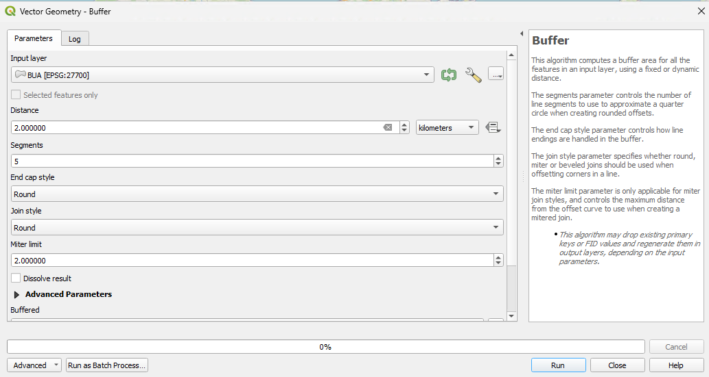
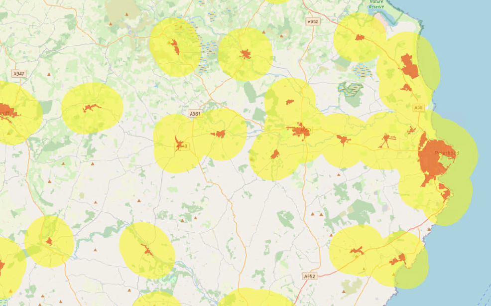
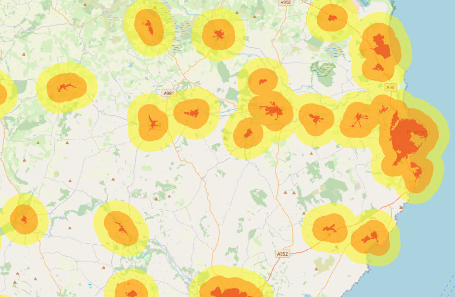
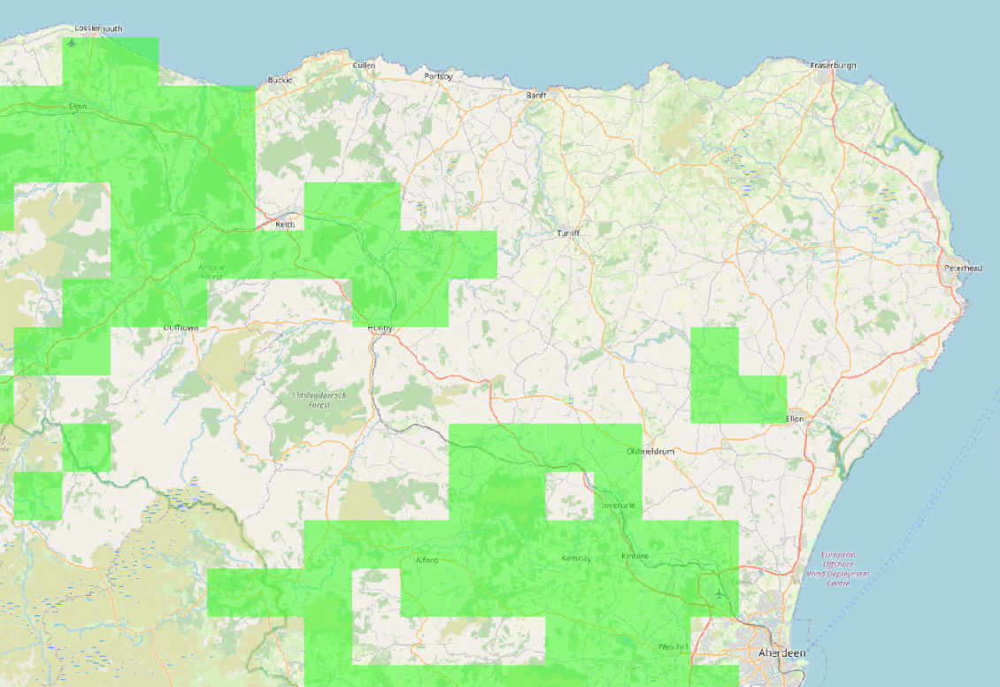
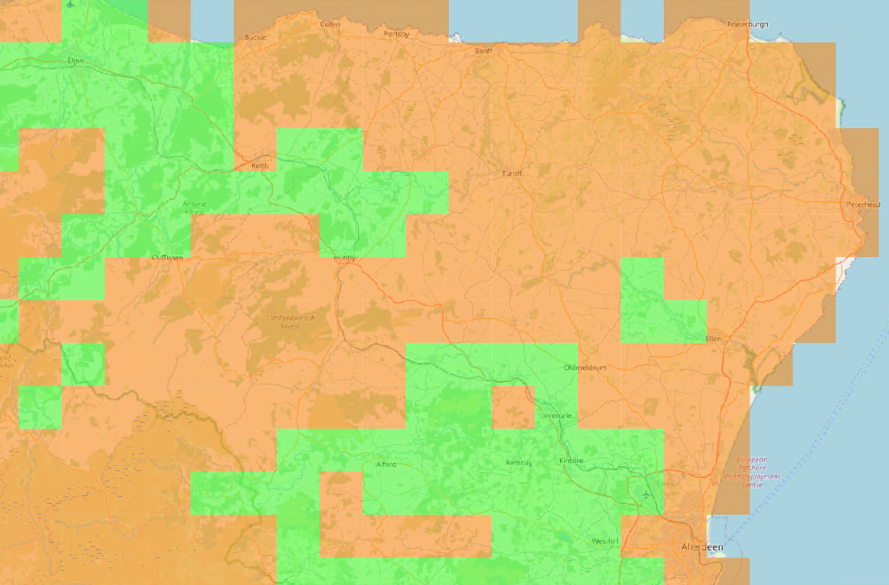
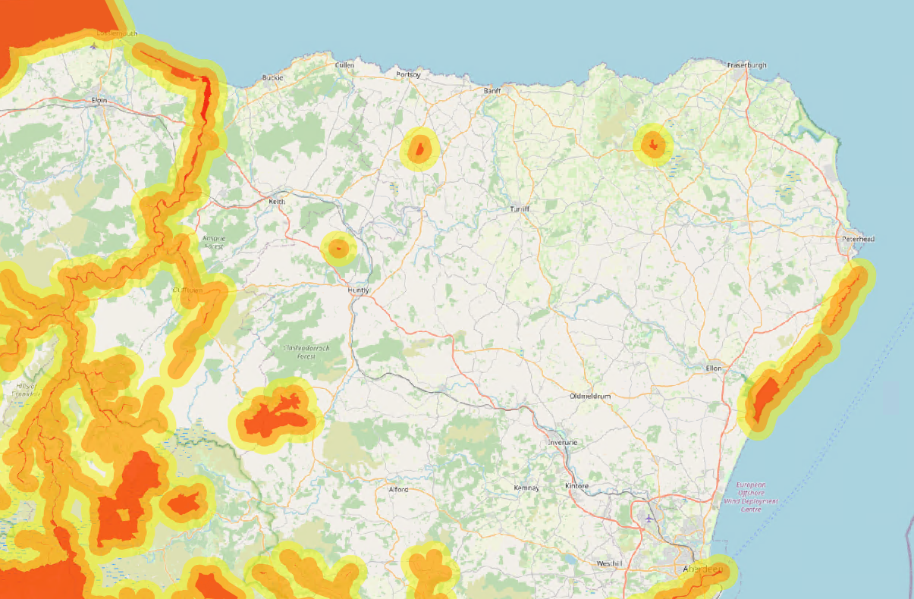
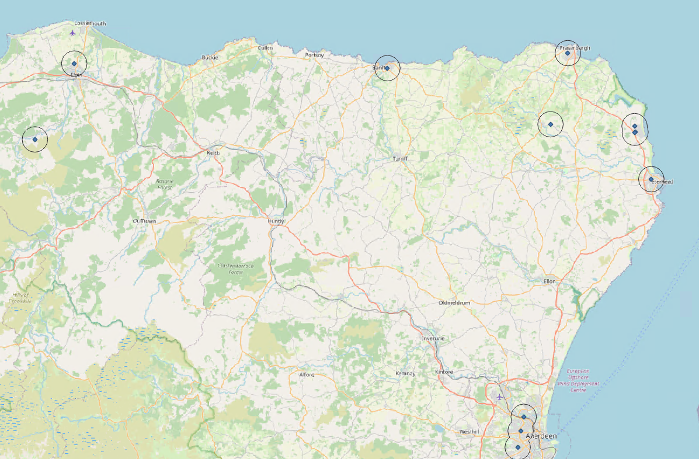
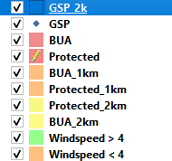
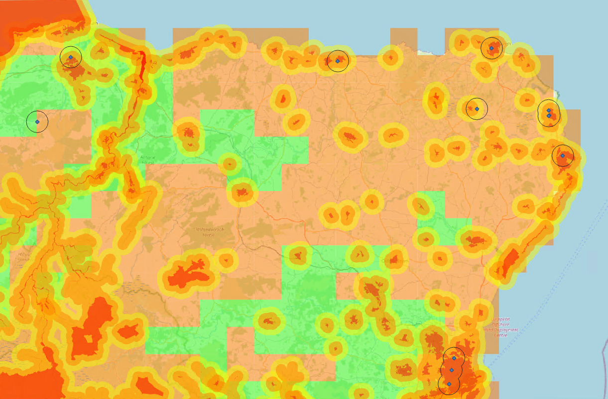

# Create Site Selection View

This article covers the steps needed to generate a Site selection view using the data described in [Data Download and Preparation](Data%20Download%20and%20Preparation.md).

## Site Selection Requirements

The following constraints have been added to the NOVA proof of concept demonstrator for the placement of wind turbines.

- 2km from Residential Areas
- Average windspeed must be above 4 m/s
- 2km from Protected Areas
- Within 2km of a Grid Supply Point

For now all prepared data is being stored as Geojson files using the OSGB National grid co-ordinate reference system (ESPG: 27700). Geospatial actions have been undertaken in QGIS, in the future I recommend these functions are handled in a PostGIS database.

## 2km from Residential Areas

In order to obtain a 2km radius from each of the residential areas the polygons are buffered using the buffer tool within QGIS.

The following out put is produced:

To give a more graduated feel a further buffer is created at 1km and added to the other layers:

These layers are added to the map using 50% opacity with a red amber yellow colour pallet.

## Windspeed above 4m/s

A simple filter on the windspeed is used to identify areas where the windspeed meets the constraints, these are then added to the map and displayed in green using 50% opacity.

The same process is then ran in reverse to identify areas where windspeed does not meet the criteria. These are displayed in amber using 50% opacity.

## 2km from Protected Areas

In order to obtain a 2km radius from each of the protected areas the polygons are buffered using the buffer tool within QGIS.

The process is exactly the same as the one for residential areas within this article. with the following output.

## Within 2km of a Grid supply point

Again using the buffer tool within QGIS the point features for Grid supply points are buffered by 2km, giving the following result.

## Site Selection View

These separate layers are then ordered as shown:

This creates the following view.

From the above image the optimal location would be around the west side of the grid supply point shown furthest west on the above map.
