# Data Download and Preparation

This article covers the steps needed to download and process data to be used in the NOVA proof of concept demonstrator.

## **Data requirements:**

- Elevation
- Residential areas
- Average windspeed
- Grid supply points
- Protected areas

It’s important to understand the level of accuracy when using global projection systems such as WGS 1984 reduces the further you are from the equator. Great Britan covers multiple UTM grid zones so we cannot project data to one zone.

So, reduce distortion and provide more accurate analysis values we will be using the OSGB National grid co-ordinate reference system (ESPG: 27700).

## Elevation Data

To meet the requirements outlined in the project we have selected to use 1 and 2 metre resolution lidar composite tiles supplied from the government data services platform. This dataset is published by the environment agency. The tiles we are processing come from the LIDAR Composite Digital Terrain Model (DTM).

Downloaded from:

<https://environment.data.gov.uk/dataset/13787b9a-26a4-4775-8523-806d13af58fc>

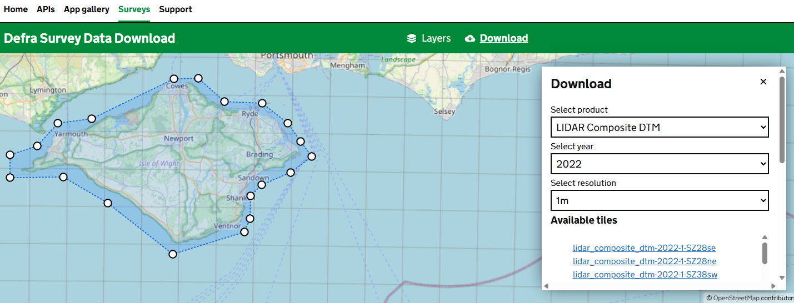

The data is downloaded for 1m resolution tiles where possible, the data is then validated and checked within Quantum GIS (QGIS).

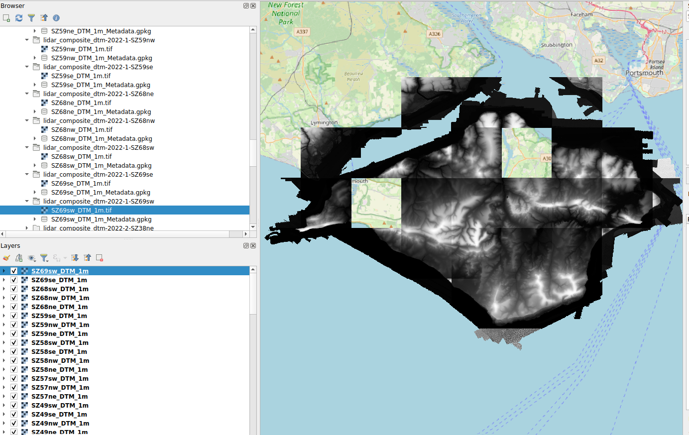

As the image above shows we are missing 2 tiles of 1m LIDAR data for the Isle of Wight these missing tiles will need to be downloaded at 2m resolution to fill the gaps.

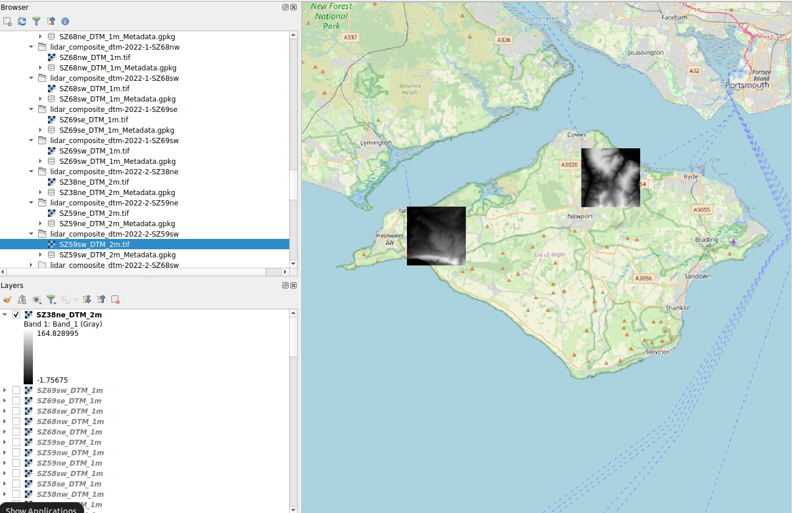

These 2m patches are then merged with the existing tiles to form a composite Digital Terrain Model with full coverage of the Ilse Of Wight.

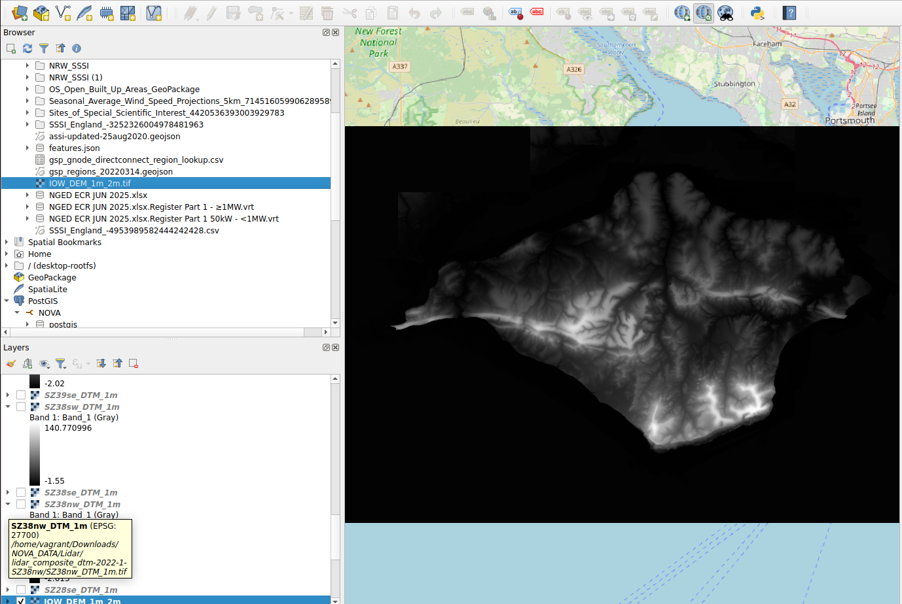

This layer is then exported using the EPSG:27700 - OSGB36 / British National Grid co-ordinate reference system and exported to the AWS S3 bucket **537124944113-nova-datascience** to be shared with the NOVA developers (note this layer is 1GB in size).

## Residential Areas

For this piece of work we are using the OS Open Data Built Up Areas dataset. OS Open Built Up Areas represents the built-up areas of Great Britain equal to or greater than 200,000m² or 20 hectares and they include unique names, alternative language names and GSS codes.

Download from:

[OS Data downloads | OS Data Hub](https://osdatahub.os.uk/downloads/open/BuiltUpAreas)

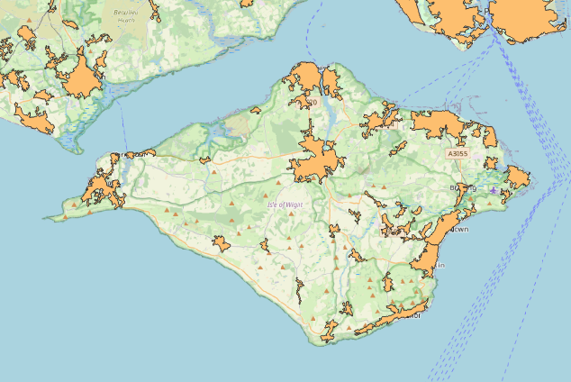

The following attribution fields are available for analysis:

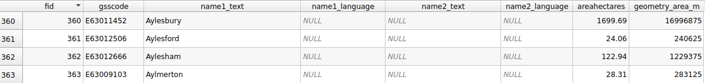

This dataset is downloaded as a GeoPackage and exported to GeoJSON using the EPSG:27700 - OSGB36 / British National Grid co-ordinate reference system and exported to the AWS S3 bucket **537124944113-nova-datascience** in the sub folder GeoJSON.

## Windspeed

We are currently using the Seasonal Average Wind Speed - Projections (5km) dataset provided by the UK Met office. This dataset contains seasonal averages of wind speeds on a 5km British National Grid (BNG). Here, the seasons are defined as winter (December, January and February), spring (March, April and May), summer (June, July and August) and autumn (September, October and November). The averages are calculated using 20 years of data for different time periods. The wind speeds reflect those at a height of 10 m above local ground level.

Download From:

[Seasonal Average Wind Speed - Projections (5km) | The Met Office climate data portal](https://climatedataportal.metoffice.gov.uk/datasets/seasonal-average-wind-speed-projections-5km/explore?location=52.889953%2C-3.309202%2C5.47)

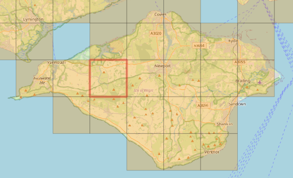

Attribution for this dataset is plentiful, when referring back to the met office site it shows that all ws\_\*\*\*\*1 fields relate to the windspeed spring baseline median. I recommend these average value fields for the analysis.

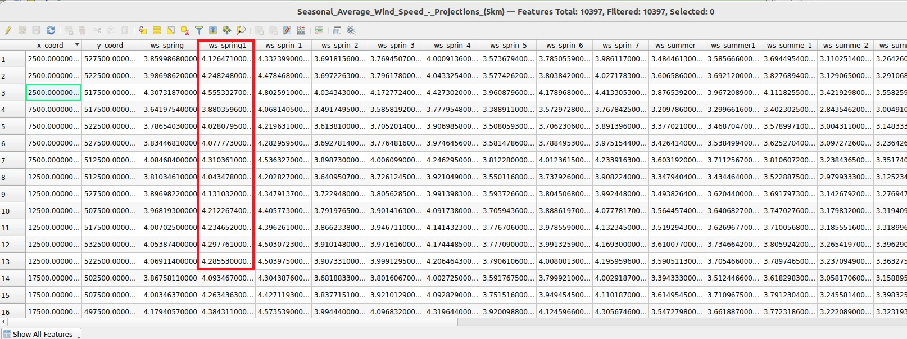

This dataset is downloaded as a Shapefile and exported to GeoJSON using the EPSG:27700 - OSGB36 / British National Grid co-ordinate reference system and exported to the AWS S3 bucket **537124944113-nova-datascience** in the sub folder GeoJSON.

## Grid Supply Points

In order to find a data set that provides best coverage of the Isle of Wight we chose to use the Scottish and Southern Electricity Networks substation data. This dataset provides details of SSEN Substations, their type and identification and location coordinates for both SEPD and SHEPD licence areas provided in csv format.

Download from:

[Data Assets](https://data.ssen.co.uk/search?q=grid+supply)

As the data is in csv format it is converted to a layer using the add spreadsheet layer for QGIS.

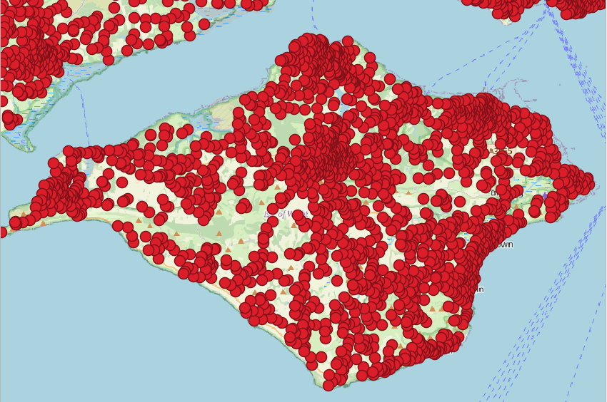

The layer provides details on all substations including distribution stations so must be filtered by type in the following way.

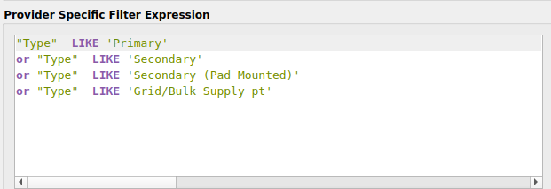

This returns only the values we could consider as grid supply points.

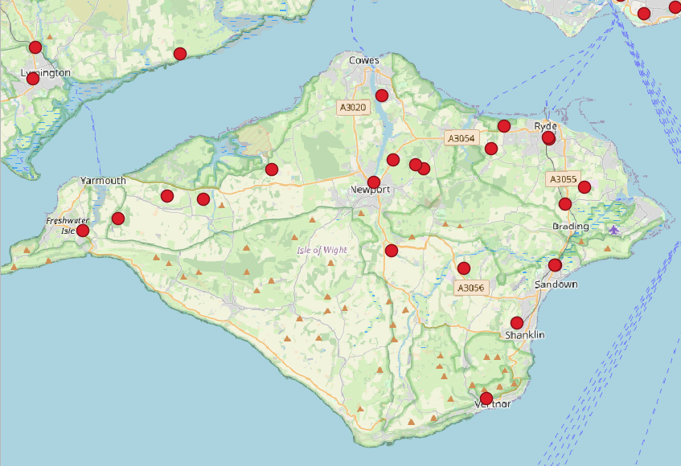

This dataset is downloaded as a CSV this is converted and filtered before being exported to GeoJSON using the EPSG:27700 - OSGB36 / British National Grid co-ordinate reference system and exported to the AWS S3 bucket **537124944113-nova-datascience** in the sub folder GeoJSON.

## Protected Areas

The following features are considered protected areas within the UK (with Download links):

- Areas of outstanding natural beauty

  - <https://naturalengland-defra.opendata.arcgis.com/datasets/6f2ad07d91304ad79cdecd52489d5046_0/about>
- Sites of Special Scientific Interest

  - <https://naturalengland-defra.opendata.arcgis.com/datasets/sites-of-special-scientific-interest-england/explore>
- Special Areas of Conservation

  - <https://hub.jncc.gov.uk/assets/52b4e00d-798e-4fbe-a6ca-2c5735ddf049>

### Areas of outstanding natural beauty

Published by Natural England this data set shows all protected and managed areas of natural beauty within the UK.

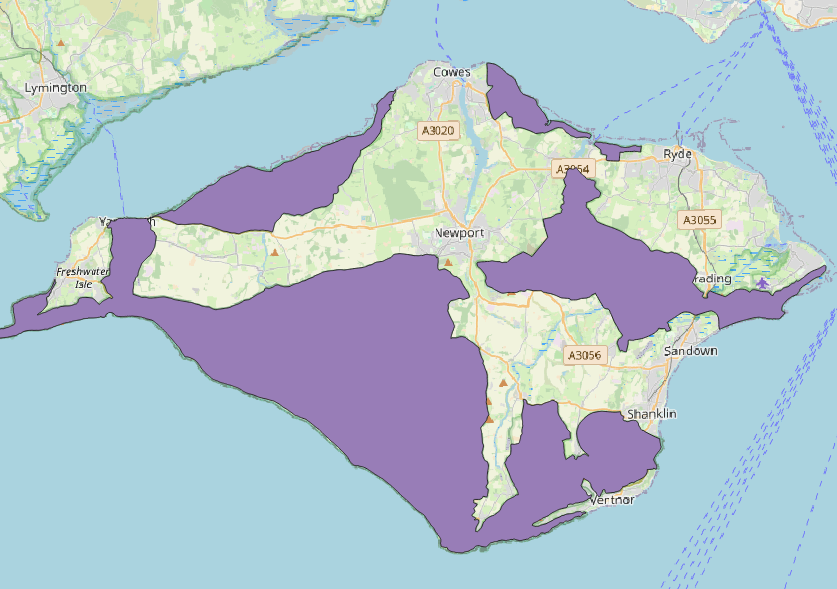

The following attributes are available for interrogation:

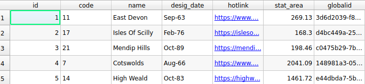

This dataset can be downloaded directly to GeoJSON using the EPSG:27700 - OSGB36 / British National Grid co-ordinate reference system, a copy is also stored in the AWS S3 bucket **537124944113-nova-datascience** in the sub folder GeoJSON.

### Sites of Special Scientific Interest

This data set shows any Site of Special Scientific Interest (SSSI) this is the land notified as an SSSI under the Wildlife and Countryside Act (1981).

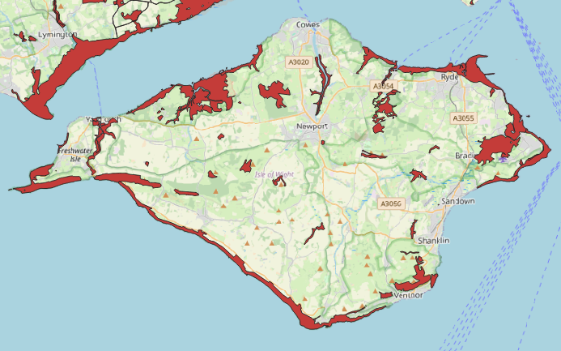

The following attributes are available for interrogation:

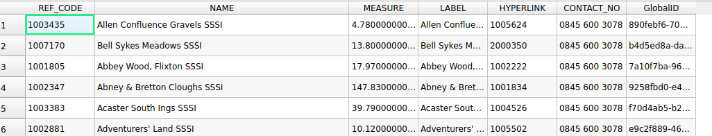

This dataset can be downloaded directly to GeoJSON using the EPSG:27700 - OSGB36 / British National Grid co-ordinate reference system, a copy is also stored in the AWS S3 bucket **537124944113-nova-datascience** in the sub folder GeoJSON.

### Special Areas of Conservation

This resource contains the spatial dataset of Special Areas of Conservation in Great Britain (excluding offshore areas), and is available as a GeoJSON Download.

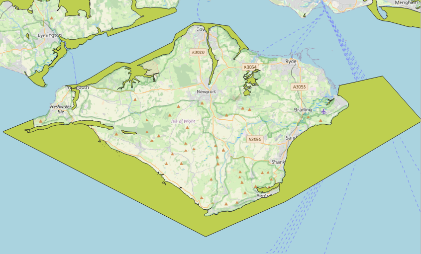

The following attributes are available for interrogation:

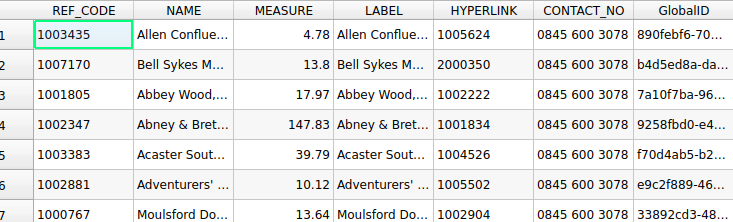

This dataset can be downloaded directly to GeoJSON using the EPSG:27700 - OSGB36 / British National Grid co-ordinate reference system, a copy is also stored in the AWS S3 bucket **537124944113-nova-datascience** in the sub folder GeoJSON.

### Protected Areas Layer

A composite layer showing all 3 protected areas has been created by merging in QGIS:

- Areas of outstanding natural beauty
- Sites of Special Scientific Interest
- Special Areas of Conservation

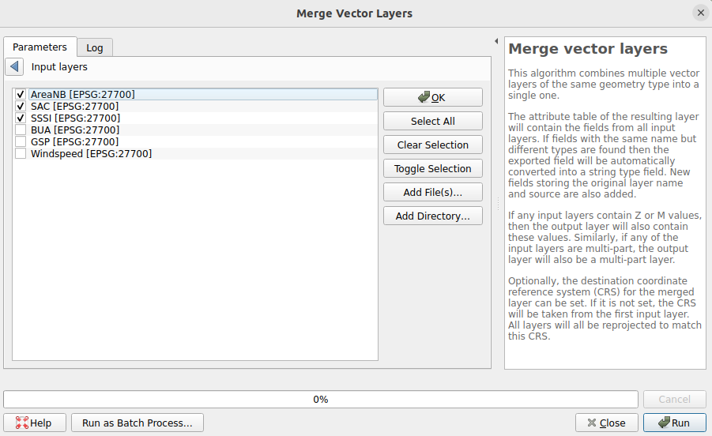

The output generates the following:

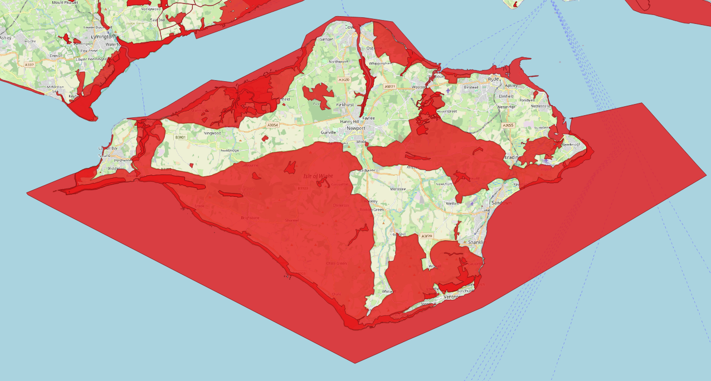

This layer maintains all the attributes of the input layers:

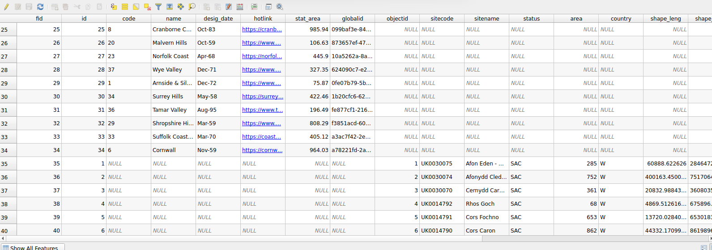

This dataset is exported to GeoJSON using the EPSG:27700 - OSGB36 / British National Grid co-ordinate reference system, a copy is also stored in the AWS S3 bucket **537124944113-nova-datascience** in the sub folder GeoJSON.
