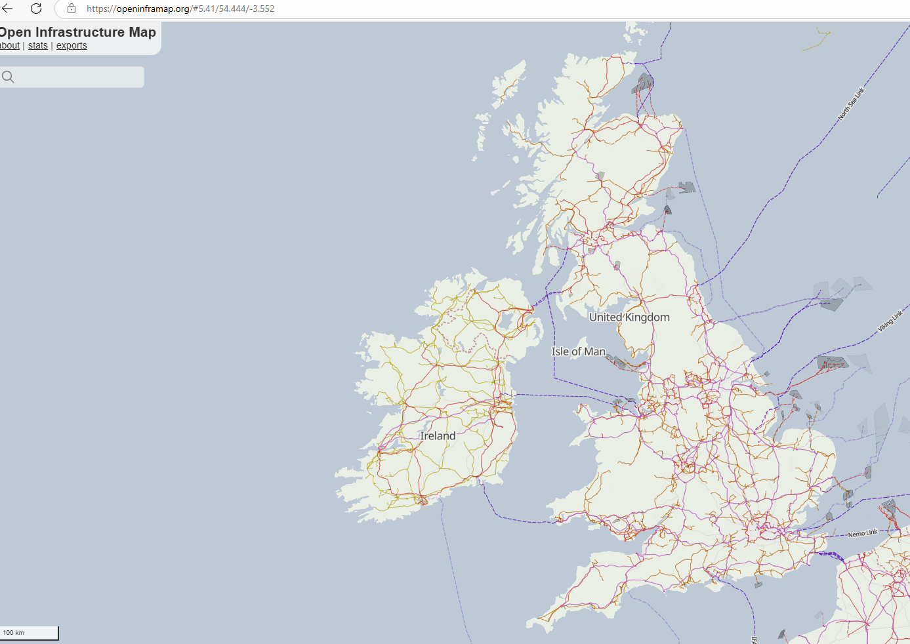
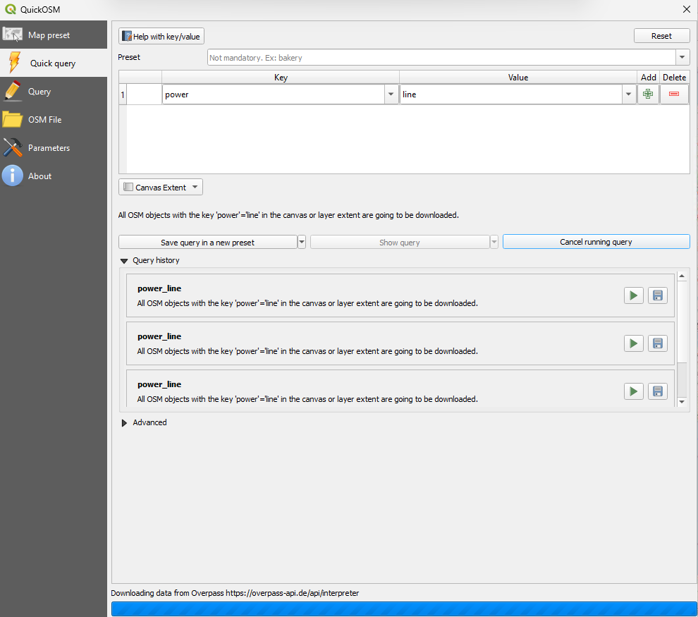
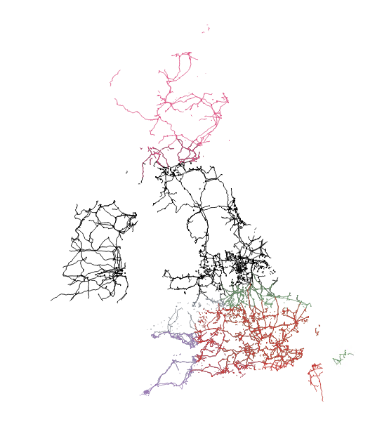
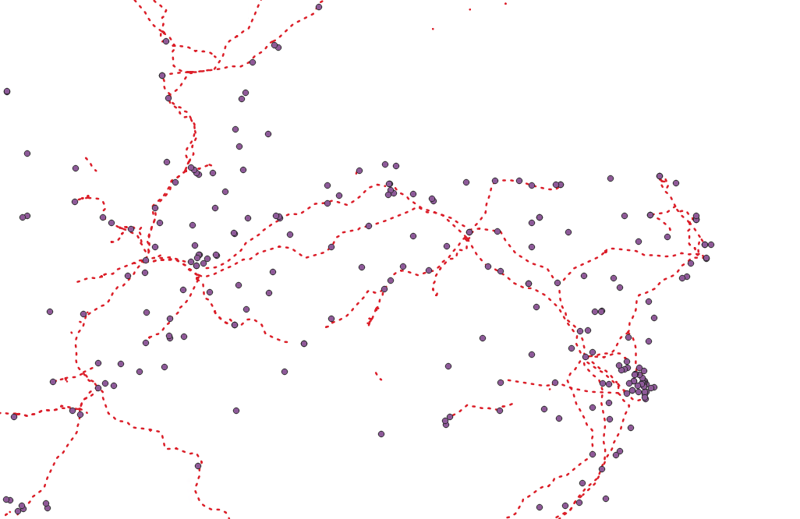
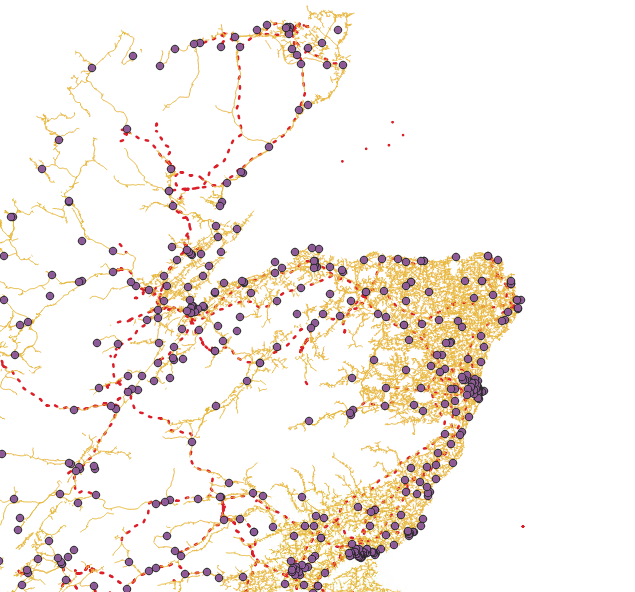
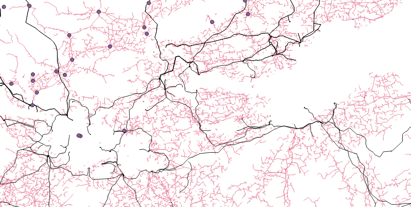
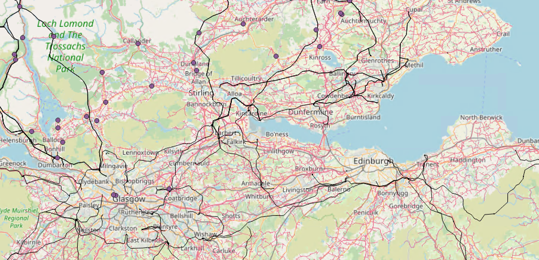

# Electricity Network Transmission Data

This article explains the download and preparation of the electricity network coverage data used for the NOVA proof of concept demonstrator.

Requirement:

The demonstrator must show a connection to the network infrastructure.

Having already obtained the data for grid supply points ands substations (see [Data Download and Preparation](Data%20Download%20and%20Preparation.md) we are missing the power line information.

The original thinking was that this information would be easily obtained from the [Network route maps | National Grid](https://www.nationalgrid.com/electricity-transmission/network-and-infrastructure/network-route-maps#4257225834-2829989424-1) data page, however the data available is only a subset of data covering only England’s main power lines. The data is available from multiple sources online depending who owns are manages the infrastructure.

The only source that I could find that incorporates all the data was on the Open Infrastructure Map website [Open Infrastructure Map](https://openinframap.org/#5.41/54.444/-3.552). This map had been generated using OpenStreetMap.

## Downloading the data

As the Data is freely available through the OpenStreetMap project it was downloaded via the Overpass Turbo API [overpass turbo](https://overpass-turbo.eu/). In this case I used a plug-in for QGIS (QuickOSM) where I could download the data in segments that would not result in the API timing out.

This gave full coverage of the Uk's main powerlines that can then merged together to form a seamless layer.

For validation this was referenced against our substation data set, as the image below shows more granularity is needed to capture the power lines that go to some of the secondary and primary substations.

/

To gather the extra data I downloaded the minor power lines for the area of Scotland using the overpass query ‘power=minor\_lines’. Thus giving the smaller network cables in the area.

/

Both files are available in s3://537124944113-nova-datascience/4326/ with the file names MajorPowerLine.geojson and MinorPowerLine.geojson.

During development it was noted that this data set does not show detailed power line data over large built up areas such as main cities and towns. This data set is open source and could probably been supplemented with data purchased from energy suppliers.

